# 🤖 Aviad Ezra's Robotics Learning Plan

### *Tailored for a senior dev in 🇮🇱 Israel · From Simulation to Real Hardware*

> **👤 Audience:** Senior developer (25 yrs), based in 🇮🇱 Israel, new to robotics.
> **🎯 Strategy:** Master the *software stack* in simulation first, then buy hardware with confidence.
> **⏱️ Time to working physical robot:** ~3–6 months of part-time work.

---

## 🧭 Guiding Principles

| # | Principle | Why it matters |
|:-:|---|---|
| 1️⃣ | **Simulate before you solder** | Bugs in simulation cost minutes; bugs on hardware cost weeks (and broken motors). |
| 2️⃣ | **Standard stack = ROS 2** | Lingua franca of modern robotics — every serious platform, paper, and job uses it. Skip ROS 1 (EOL May 2025). |
| 3️⃣ | **Pick one robot archetype first** | Don't try mobile + arm + drone simultaneously. Recommended start: **mobile ground robot (differential drive)** — easiest physics, richest tutorials, cheapest hardware. |
| 4️⃣ | **Math matters** | Brush up on linear algebra, rigid-body transforms (SE(3)), and basic probability (for SLAM/Kalman filters). |

---

## 🛠️ Phase 0 — Environment Setup


> ⏰ **1 weekend** &nbsp;·&nbsp; 🎯 **Goal:** ROS 2 + Gazebo running inside WSL2 on your Windows 11 laptop, "Hello, turtle" working.

We're going **WSL2 + WSLg + Ubuntu 24.04** — keeps you on Windows, gets you a real Linux for ROS, and WSLg gives you the GUI windows (RViz/Gazebo) for free.

### 📋 Step-by-step setup

**1. Confirm prerequisites** (open PowerShell as Administrator)
```powershell
winver           # must be Windows 11 (build 22000+)
wsl --status     # if "not installed", that's expected — next step fixes it
```

**2. Install WSL + Ubuntu 24.04**
```powershell
wsl --install -d Ubuntu-24.04
```
Reboot when prompted. On first launch, set a Linux username + password (any value — local only).

**3. Update GPU drivers (host Windows)**
- 🟢 NVIDIA: install the latest [CUDA-on-WSL driver](https://developer.nvidia.com/cuda/wsl)
- 🔴 AMD: latest Adrenalin
- 🔵 Intel: latest from intel.com/download

**4. Install ROS 2 Jazzy + Gazebo inside Ubuntu**

From the Ubuntu shell:
```bash
# Enable universe + add ROS 2 apt key
sudo apt update && sudo apt install -y software-properties-common curl
sudo add-apt-repository universe
sudo curl -sSL https://raw.githubusercontent.com/ros/rosdistro/master/ros.key \
  -o /usr/share/keyrings/ros-archive-keyring.gpg
echo "deb [arch=$(dpkg --print-architecture) signed-by=/usr/share/keyrings/ros-archive-keyring.gpg] \
  http://packages.ros.org/ros2/ubuntu $(. /etc/os-release && echo $UBUNTU_CODENAME) main" \
  | sudo tee /etc/apt/sources.list.d/ros2.list > /dev/null

# Install desktop bundle (RViz2, demos, etc.) + Gazebo
sudo apt update
sudo apt install -y ros-jazzy-desktop-full ros-jazzy-ros-gz

# Source ROS in every new shell
echo "source /opt/ros/jazzy/setup.bash" >> ~/.bashrc
source ~/.bashrc
```

**5. VS Code with Remote-WSL**
- Install [VS Code](https://code.visualstudio.com/) on Windows (already done ✅)
- Install the **WSL** extension (formerly "Remote - WSL")
- From Ubuntu shell: `code .` opens VS Code attached to WSL

**6. If WSLg renders GUIs as a black window — switch to VcXsrv** *(needed on multi-GPU laptops, e.g. Intel + NVIDIA + DisplayLink dock)*

Symptom: turtlesim/RViz/Gazebo windows open but are entirely black, or appear in the taskbar but won't come to the foreground (look for `[WARN:COPY MODE]` in the window title). The fix is to bypass WSLg with a native Windows X server.

```powershell
# On Windows host (PowerShell as Admin)
winget install --id marha.VcXsrv
# Open the firewall for X11 traffic from WSL
New-NetFirewallRule -DisplayName "VcXsrv (WSL X11)" -Direction Inbound `
  -Protocol TCP -LocalPort 6000-6063 -Action Allow -Profile Any
```

Launch VcXsrv with the right flags (or save these into the Startup folder so it auto-starts):
```
"C:\Program Files\VcXsrv\vcxsrv.exe" -multiwindow -clipboard -wgl -ac -noprimary
```

Then in Ubuntu, append to `~/.bashrc` and reload:
```bash
echo 'export DISPLAY=$(ip route show default | awk "{print \$3}"):0' >> ~/.bashrc
echo 'unset WAYLAND_DISPLAY' >> ~/.bashrc
source ~/.bashrc
```

GUI apps now render through VcXsrv (the window title shows an "X" icon instead of the Tux/penguin) and the COPY-MODE bug is gone.

### ✅ Validation checkpoint
From the Ubuntu shell:
```bash
ros2 run turtlesim turtlesim_node
```
A blue window with a little turtle should pop up on your Windows desktop (via WSLg). In a second Ubuntu shell:
```bash
ros2 run turtlesim turtle_teleop_key
```
Use the arrow keys — if the turtle moves, **Phase 0 is done**.

<figure class="screenshot">
  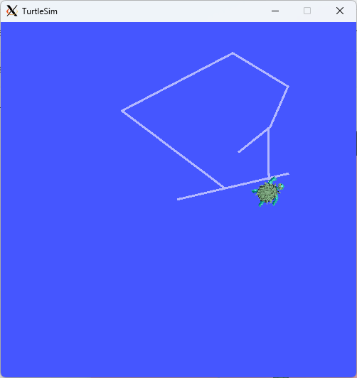
  <figcaption>🐢 Real result from my own Phase 0 run — turtle responding to arrow-key teleop and drawing its path. Window rendered via VcXsrv on Windows 11 (note the "X" icon in the title bar). If your turtle moves and leaves a trail, ROS 2 + your display stack are fully working.</figcaption>
</figure>

---

## 📚 Phase 1 — ROS 2 Fundamentals


> ⏰ **2–3 weeks** &nbsp;·&nbsp; 🎯 **Goal:** Comfortable with nodes, topics, services, actions, parameters, launch files, tf2, URDF.

### ⌨️ Terminal essentials *(quick reference — bookmark this)*

You're about to spend a lot of time in the Ubuntu terminal (and in Phase 3 you'll juggle 3–5 of them at once). These are the shortcuts that turn the terminal from a chore into a tool. **All of these work in the default GNOME / Windows Terminal Ubuntu shell** unless noted.

#### 🧹 Clean the screen / control output

| Shortcut | What it does | When you'll want it |
|---|---|---|
| `Ctrl+L` | Clear the screen (but keep history accessible by scrolling up) | After a noisy build, before running the next command |
| `clear` | Same as `Ctrl+L` (a command, not a shortcut) | When you want to type it instead |
| `reset` | Hard-reset the terminal — clears screen *and* fixes a corrupted terminal state | After `cat`ing a binary file by accident and seeing garbage characters |
| `Ctrl+Shift+K` *(Windows Terminal)* | Clear the buffer entirely (no scrollback) | When you want a truly fresh slate |

#### 🛑 Stop / pause / resume processes

| Shortcut | What it does |
|---|---|
| `Ctrl+C` | **Send SIGINT** — politely ask the running command to stop. Use this for `ros2 launch`, `ros2 topic echo`, teleop nodes, etc. |
| `Ctrl+\` | Send SIGQUIT — harder kill, dumps core. Use if `Ctrl+C` doesn't work. |
| `Ctrl+Z` | Suspend the foreground process (it pauses, doesn't die) |
| `bg` | Resume a `Ctrl+Z`'d process in the background |
| `fg` | Bring a backgrounded process back to the foreground |
| `jobs` | List currently suspended / backgrounded processes |
| `kill %1` | Kill backgrounded job number 1 (from `jobs` output) |

#### ✏️ Edit the current line faster

| Shortcut | What it does |
|---|---|
| `Ctrl+A` / `Ctrl+E` | Jump to start / end of the line |
| `Alt+B` / `Alt+F` | Move backward / forward one **word** |
| `Ctrl+W` | Delete the word before the cursor |
| `Ctrl+U` | Delete from cursor to start of line (great for "scrap this and retype") |
| `Ctrl+K` | Delete from cursor to end of line |
| `Ctrl+Y` | Paste back whatever you last deleted with `Ctrl+W` / `Ctrl+U` / `Ctrl+K` |
| `Ctrl+T` | Swap the two characters before the cursor (typo fix) |

#### 🔍 Recall previous commands

| Shortcut | What it does |
|---|---|
| `↑` / `↓` | Step through command history |
| `Ctrl+R` | **Reverse search** — type a fragment, hit `Ctrl+R` again to find older matches. `Enter` to run, `Esc` to edit before running. |
| `!!` | Repeat the previous command. Combine: `sudo !!` re-runs the last command with sudo. |
| `!ros2` | Re-run the most recent command starting with `ros2` |
| `history \| grep launch` | Search your history for anything containing "launch" |

#### 📋 Copy & paste (the trap)

In a Linux terminal `Ctrl+C` is **kill**, not copy! Use:

| Shortcut | What it does |
|---|---|
| `Ctrl+Shift+C` | Copy selected text |
| `Ctrl+Shift+V` | Paste |
| **Middle-click** | Paste the most recently selected text (X11 primary selection) |
| **Just select text** | Auto-copies on most terminals — no `Ctrl+Shift+C` needed |

#### 🪟 Tabs, splits & multiple terminals

You'll need many terminals running at once (one for `ros2 launch`, one for teleop, one for `ros2 topic echo`, etc.). Options, best → simplest:

| Tool | How | Why |
|---|---|---|
| **`tmux`** | `sudo apt install tmux` then `tmux` to start, `Ctrl+B` then `"` to split horizontal, `%` to split vertical, arrow keys to navigate, `d` to detach (and `tmux attach` to come back) | Survives SSH disconnects, lets you save layouts, runs on any Linux. Worth learning once for a 10× workflow boost. |
| **GNOME Terminal tabs** | `Ctrl+Shift+T` new tab, `Ctrl+PgUp/PgDn` switch | Built-in, no install |
| **Windows Terminal panes** *(if you launched Ubuntu from WT)* | `Alt+Shift+D` split, `Alt+arrow` navigate | Native split UI on Windows |

#### 🗂️ Navigate the filesystem

| Shortcut | What it does |
|---|---|
| `Tab` | **Autocomplete** filenames, package names, even `ros2` subcommands. **Hit it constantly** — saves you from typos. |
| `Tab Tab` | Show all possible completions when there's more than one |
| `cd -` | Go back to the previous directory |
| `cd` (no args) | Go to `~` (home) |
| `pushd /some/path` / `popd` | Push current dir onto a stack, jump elsewhere, pop back |
| `Ctrl+D` | Exit the current shell (same as typing `exit`) |

#### 🎁 ROS-specific helpers

| Trick | What it does |
|---|---|
| `ros2 <Tab><Tab>` | List every `ros2` subcommand |
| `ros2 launch <pkg> <Tab>` | Autocomplete the available launch files in a package |
| `ros2 topic echo /<Tab>` | Autocomplete topic names from the live system |
| `printenv \| grep ROS` | Show every ROS-related env var currently set (sanity check that `~/.bashrc` did the right thing) |
| `ros2 daemon stop && ros2 daemon start` | Hard-restart the ROS 2 discovery daemon if `ros2 node list` is hanging or showing stale entries |

> 💡 **The single highest-ROI habit**: hit `Tab` after every two or three keystrokes. ROS 2 names are long (`turtlesim_node`, `geometry_msgs/msg/Twist`, `tb3_simulation_launch.py`) and Tab-completion knows them all.

---

### 📋 Step 1 — Create your ROS 2 workspace (do this once)

A *workspace* is just a folder where your ROS 2 packages live and where the `colcon` build tool compiles them. Every ROS 2 project you write will live here.

You'll be typing commands into the **Ubuntu terminal** (not Windows PowerShell). Run each command one at a time, wait for it to finish, then move on.

---

**1.1 Open Ubuntu**

Press the Windows key → type `Ubuntu` → click *Ubuntu 24.04*.

A terminal window opens. The prompt looks like `aviad@HOSTNAME:~$`. The `~` means you're in your home folder (`/home/aviad`). ✅

---

**1.2 Confirm ROS 2 is installed and active**

Type:
```bash
ros2 --help
```

**Expected:** a long list of subcommands (`bag`, `node`, `run`, `topic`, …).

**If you see `ros2: command not found`** → ROS 2 isn't being loaded automatically. Fix it by running these two commands:
```bash
echo "source /opt/ros/jazzy/setup.bash" >> ~/.bashrc
source ~/.bashrc
```
Then try `ros2 --help` again.

---

**1.3 Create the workspace folder**

```bash
mkdir -p ~/ros2_ws/src
```
Creates `~/ros2_ws/` with an empty `src/` subfolder inside it. The `-p` flag means "create parent folders too, don't error if they exist".

```bash
cd ~/ros2_ws
```
Moves you into the workspace. Your prompt should now end with `~/ros2_ws$`.

> ℹ️ The `src/` subfolder is **mandatory** — `colcon` only looks for packages there. The other folders (`build/`, `install/`, `log/`) will be created automatically the first time you build.

---

**1.4 Install the ROS 2 build tools (one-time)**

You need three packages: **colcon** (the build system), **rosdep** (resolves system dependencies of ROS packages), and **argcomplete** (tab-completion for `ros2`). Run these commands **one at a time, in order**:

**Command 1 of 4** — refresh the apt package index:
```bash
sudo apt update
```
On this machine, `sudo` is configured **passwordless** for the `aviad` user (set up in Phase 0), so it runs immediately. On a fresh install where you set a password during first launch, this is where Ubuntu would ask for it.

**Command 2 of 4** — install the three tool packages:
```bash
sudo apt install -y python3-colcon-common-extensions python3-rosdep python3-argcomplete
```
Takes ~30 seconds. The `-y` means "answer yes to confirmation prompts".

**Command 3 of 4** — initialize the system-wide rosdep database:
```bash
sudo rosdep init
```
**Expected:** `Wrote /etc/ros/rosdep/sources.list.d/20-default.list`.
**If you see** `ERROR: default sources list file already exists` → ignore it, that just means it was already initialized. Move on.

**Command 4 of 4** — pull down the latest dependency mappings (this one is *not* sudo):
```bash
rosdep update
```
Takes ~20 seconds. Lots of `reading in sources list data` lines, ending with `updated cache`.

---

**1.5 Do an empty build to prove the workspace works**

```bash
cd ~/ros2_ws
colcon build --symlink-install
```
Takes ~5 seconds.

**Expected output:** ends with `Summary: 0 packages finished` — that's correct, you don't have any packages yet, you're just confirming `colcon` runs.

Now check the folder contents:
```bash
ls
```
**Expected:** you should see `build  install  log  src` — those three new folders were created by the build. ✅

> 💡 The `--symlink-install` flag means Python files in your packages will be *symlinked* (not copied) into `install/`. So when you edit a `.py` you don't need to rebuild. Always use it during development.

---

**1.6 Make every new terminal auto-load your workspace**

```bash
echo "source ~/ros2_ws/install/setup.bash" >> ~/.bashrc
```
Appends one line to your shell startup file. From now on, every Ubuntu terminal you open will automatically know about packages in `~/ros2_ws`.

```bash
source ~/.bashrc
```
Re-loads `.bashrc` in the *current* terminal so you don't have to close it.

> ℹ️ This is called "overlaying" — your workspace sits on top of the system ROS install. Any package you build in `~/ros2_ws/src/` becomes available to `ros2 run`, `ros2 launch`, etc.

---

**1.7 Open the workspace in VS Code**

```bash
cd ~/ros2_ws
code .
```
The first time you run `code` from WSL, it installs the VS Code Server inside Ubuntu (~30 seconds, one-time). VS Code then opens on Windows with a green `>< WSL: Ubuntu-24.04` badge in the bottom-left corner — that confirms it's attached to Ubuntu, not Windows.

Now install the extensions you'll need. Click the **Extensions** icon in the left sidebar (the four-squares icon, or `Ctrl+Shift+X`) and search for and install each of these. **Important:** each one must say *"Install in WSL: Ubuntu-24.04"* on the green button (not just "Install"):

- **Robotics Developer Environment** by Ranch Hand Robotics — the extension pack that replaces the now-deprecated Microsoft `ROS` extension. It bundles the Robot Developer Extension for ROS 2 + URDF/Xacro editor + related tooling. *(If VS Code suggested it as a replacement, accept the suggestion — it's the right one.)*
- **Python** by Microsoft — IntelliSense + debugger
- **CMake Tools** by Microsoft — for C++ packages later

> ⚠️ **Don't install the old `ROS` extension by Microsoft (`ms-iot.vscode-ros`)** — it was archived in September 2025 when the Azure Edge Robotics team was disbanded. The same lead maintainer now ships the modern version through Ranch Hand Robotics, with active ROS 2 + AI/Copilot integration features.

---

**1.8 Smoke-test the whole stack with a stock ROS 2 demo**

You'll run two programs that ship with ROS 2 — a *talker* that publishes messages and a *listener* that subscribes — to confirm everything talks to each other.

**Terminal A** (your current Ubuntu window):
```bash
ros2 run demo_nodes_cpp talker
```
**Expected:** a line printed every second: `[INFO] [talker]: Publishing: 'Hello World: 1'`, then `2`, `3`, …

**Terminal B** — open a *second* Ubuntu window: Windows key → *Ubuntu 24.04* (yes, you can have multiple). Then:
```bash
ros2 run demo_nodes_py listener
```
**Expected:** matching lines: `[INFO] [listener]: I heard: [Hello World: 7]`, with the same numbers showing up.

**✅ If the listener sees the talker's messages, your ROS 2 workspace is fully working and you're ready for Step 2.**

<figure class="screenshot wide">
  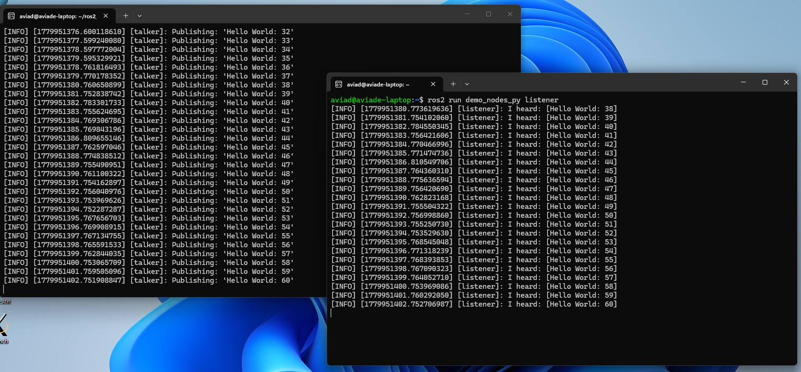
  <figcaption>🎉 My own Step 1.8 result — talker (left) publishing <code>Hello World: 32→60</code>, listener (right) echoing the same sequence. Matching numbers = pub/sub transport working end-to-end across two independent processes.</figcaption>
</figure>

To stop: in each terminal, press `Ctrl+C`.

---

### 📚 Step 2 — Explore the ROS 2 CLI with turtlesim

ROS 2's runtime is built around four core concepts: **nodes** (processes), **topics** (pub/sub streams), **services** (request/response calls), and **parameters** (live config). Plus two glue layers: **launch** (start many nodes at once) and **bag** (record/replay). The fastest way to feel them is to introspect a live system — and `turtlesim` is the perfect playground (tiny but exposes every concept).

You'll need **3 Ubuntu terminals open** for most of this step. I'll call them **Terminal A**, **B**, **C** (open a fourth, D, later).

---

**2.1 Launch turtlesim and visualize the running graph**

**Terminal A** — start turtlesim:
```bash
ros2 run turtlesim turtlesim_node
```
The blue turtle window pops up (rendered via VcXsrv).

**Terminal B** — start the keyboard teleop:
```bash
ros2 run turtlesim turtle_teleop_key
```
Click in this terminal to give it focus, then arrow keys to drive the turtle.

**Terminal C** — view the live system graph:
```bash
rqt_graph
```
A graphical window opens showing two oval nodes (`/turtlesim`, `/teleop_turtle`) connected by an arrow labeled `/turtle1/cmd_vel` (plus a couple of `/turtle1/rotate_absolute/_action/...` arrows for teleop's rotate action). Click the refresh icon (top-left) if it's empty. Those arrows *are* your running system — boxes are nodes, arrows are topics/actions.

<figure class="screenshot wide">
  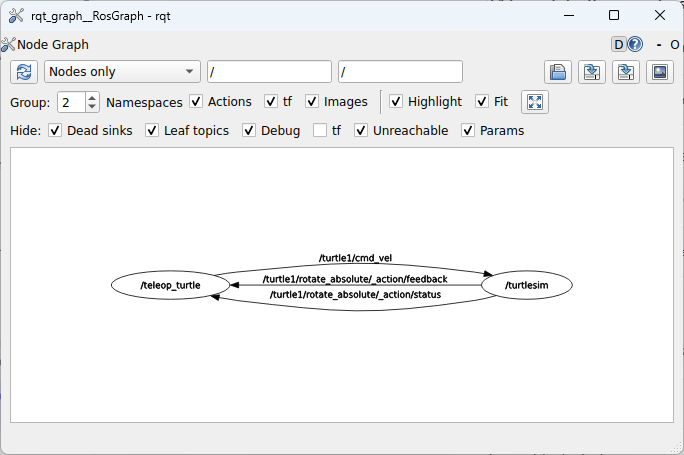
  <figcaption>🔍 My Step 2.1 result — <code>rqt_graph</code> of the live turtlesim + teleop system. Two nodes, one main pub/sub arrow (<code>/turtle1/cmd_vel</code>), plus the rotate-absolute action wiring.</figcaption>
</figure>

**Why it matters:** every ROS 2 system you'll ever build looks like this. `rqt_graph` is the first tool you reach for when joining an unfamiliar project.

Close the rqt_graph window when done (keep A and B running).

---

**2.2 List and inspect nodes**

In **Terminal C**:
```bash
ros2 node list
```
**Expected:**
```
/teleop_turtle
/turtlesim
```

```bash
ros2 node info /turtlesim
```
**Expected:** a structured dump listing every publisher, subscriber, service, and action the node exposes — `/turtle1/cmd_vel` (subscriber), `/turtle1/pose` (publisher), `/spawn` (service server), etc.

**Why it matters:** when you join a project with 30 unfamiliar nodes, this is how you reverse-engineer it. Same command, every time.

---

**2.3 Inspect topics from the CLI**

```bash
ros2 topic list
```
**Expected:** `/turtle1/cmd_vel`, `/turtle1/pose`, `/turtle1/color_sensor`, `/parameter_events`, `/rosout`.

```bash
ros2 topic echo /turtle1/pose
```
Streams the turtle's `x`, `y`, `theta` continuously. Drive the turtle in Terminal B with the arrow keys and watch the values change live. Press `Ctrl+C` when done watching.

```bash
ros2 topic hz /turtle1/pose
```
Reports the publish rate. **Expected:** `average rate: 62.5`. Ctrl-C.

**Why it matters:** `topic echo` and `hz` are 80% of how you debug a real robot from the terminal — confirm a sensor is publishing and check its rate.

---

**2.4 Publish to a topic — drive the turtle from the CLI**

Instead of using the keyboard teleop, you can inject commands yourself by publishing directly to `/turtle1/cmd_vel`. The message type is `geometry_msgs/Twist` (a linear velocity vector + an angular velocity vector).

Run this in **Terminal C**:

```bash
ros2 topic pub --once /turtle1/cmd_vel geometry_msgs/Twist \
  "{linear: {x: 2.0, y: 0.0, z: 0.0}, angular: {x: 0.0, y: 0.0, z: 1.5}}"
```

**What this means:**
- `--once` → send a single message, then exit (drop it and add `-r 1` for "publish at 1 Hz continuously")
- `/turtle1/cmd_vel` → the topic to publish on
- `geometry_msgs/Twist` → the message type
- `linear.x: 2.0` → move forward at 2 units/sec
- `angular.z: 1.5` → rotate counter-clockwise at 1.5 rad/sec
- Setting both gives you a curve

**Expected:** the turtle curves forward-and-left, leaving a drawn trail behind it.

<figure class="screenshot">
  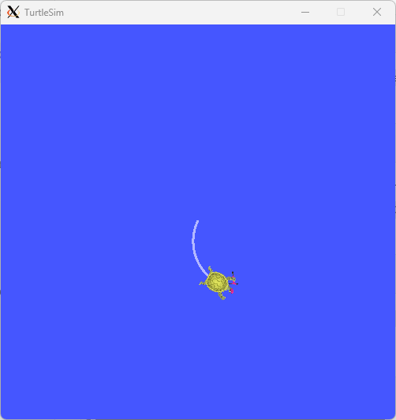
  <figcaption>🐢 My Step 2.4 result — one <code>ros2 topic pub --once</code> command sent <code>linear.x=2.0</code> and <code>angular.z=1.5</code>, and the turtle drew a curve. You just programmed a robot from the command line.</figcaption>
</figure>

Now try the **continuous** variant — drop `--once` and add `-r 1` ("publish at 1 Hz forever"):

```bash
ros2 topic pub -r 1 /turtle1/cmd_vel geometry_msgs/Twist \
  "{linear: {x: 2.0, y: 0.0, z: 0.0}, angular: {x: 0.0, y: 0.0, z: 1.5}}"
```

**Expected:** the same `linear+angular` velocity is re-applied every second, so the turtle traces a closed circle. Press `Ctrl+C` to stop.

<figure class="screenshot">
  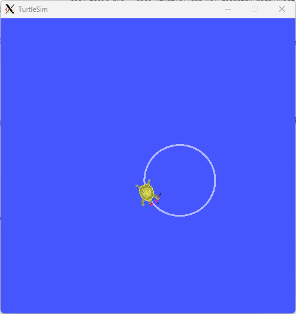
  <figcaption>🔁 My result with <code>-r 1</code> — the same Twist message at 1 Hz draws a closed circle. Constant linear + constant angular velocity = circular motion (basic differential-drive kinematics).</figcaption>
</figure>

**Why it matters:** publishing to topics from the CLI is how you smoke-test a controller, manually drive a robot when teleop is broken, or fake a sensor input during bring-up.

---

**2.5 Call services (request/response)**

Topics are streams; **services** are one-off RPC calls.

```bash
ros2 service list
```
**Expected:** `/clear`, `/reset`, `/turtle1/set_pen`, `/turtle1/teleport_absolute`, `/spawn`, `/kill`, plus parameter-related services.

```bash
ros2 service type /turtle1/teleport_absolute
```
**Expected:** `turtlesim/srv/TeleportAbsolute` — every service has a typed request/response definition.

**Teleport the turtle** to the bottom-left corner:
```bash
ros2 service call /turtle1/teleport_absolute turtlesim/srv/TeleportAbsolute \
  "{x: 1.0, y: 1.0, theta: 0.0}"
```

**Change the pen color to red**, then draw with it from Terminal B:
```bash
ros2 service call /turtle1/set_pen turtlesim/srv/SetPen \
  "{r: 255, g: 0, b: 0, width: 3, 'off': 0}"
```
*(Note: `off` is quoted because it's a YAML reserved word.)*

**Spawn a second turtle:**
```bash
ros2 service call /spawn turtlesim/srv/Spawn \
  "{x: 5.5, y: 5.5, theta: 0.0, name: 'turtle2'}"
```
**Expected:** response `name: turtle2`, and a second turtle appears in the middle of the canvas.

<figure class="screenshot">
  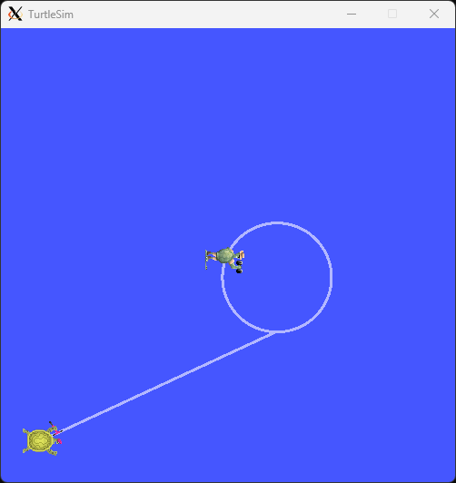
  <figcaption>🛰️ My Step 2.5 result — three services in action: <code>teleport_absolute</code> jumped turtle1 to the bottom-left corner (diagonal line is the teleport jump), <code>set_pen</code> changed the trail color, and <code>spawn</code> created turtle2 in the middle. All driven from the command line — no code written yet.</figcaption>
</figure>

**Why it matters:** topics for streams (sensor data, odometry, commands), services for events (calibrate, save map, switch mode). Wrong choice = bad architecture.

---

**2.6 Read and write parameters live**

Parameters are runtime config that a node exposes. They can be set at launch *or* changed live.

```bash
ros2 param list
```
Lists every node's parameters. Under `/turtlesim` you'll see `background_b`, `background_g`, `background_r`, `holonomic`, `use_sim_time`, plus parameter-descriptor entries.

```bash
ros2 param get /turtlesim background_b
```
**Expected:** `Integer value is: 255` (blue, hence the blue canvas).

**Change the canvas color live** to red:
```bash
ros2 param set /turtlesim background_r 255
ros2 param set /turtlesim background_g 0
ros2 param set /turtlesim background_b 0
ros2 service call /clear std_srvs/srv/Empty
```
**Expected:** the canvas redraws red **and any existing turtle trails disappear**. That's intentional — the `/clear` service both wipes the trail history *and* repaints the canvas with the current background color (params alone don't trigger a repaint; `/clear` is what applies them). If you want to keep your drawings, just don't call `/clear` after changing params — the new color will only take effect the next time someone clears.

<figure class="screenshot">
  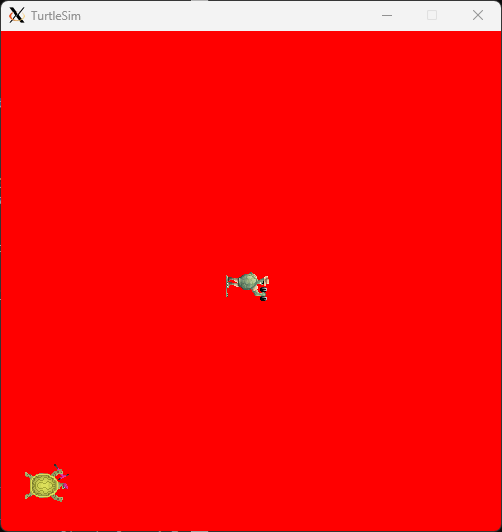
  <figcaption>🎨 My Step 2.6 result — three <code>ros2 param set</code> commands followed by <code>ros2 service call /clear</code> repainted the canvas red. Trails are gone because <code>/clear</code> wipes them; both turtles survive because they're not part of the canvas drawing.</figcaption>
</figure>

**Dump all params to a YAML file** (great for reproducible configs):
```bash
mkdir -p ~/ros2_ws/configs
ros2 param dump /turtlesim > ~/ros2_ws/configs/turtlesim_params.yaml
cat ~/ros2_ws/configs/turtlesim_params.yaml
```
Later you can restore them with `ros2 param load /turtlesim ~/ros2_ws/configs/turtlesim_params.yaml`.

**Why it matters:** parameters let you tune a node without recompiling. Real robots have hundreds (PID gains, frame names, sensor calibrations).

---

**2.7 Record and replay with `ros2 bag`**

Bag files are the killer feature for debugging — capture all messages on the wire, replay later on your laptop without the robot.

**Terminal D** (open a new Ubuntu window):
```bash
mkdir -p ~/ros2_ws/bags && cd ~/ros2_ws/bags
ros2 bag record /turtle1/cmd_vel -o demo_bag
```
Now drive the turtle around for ~10 seconds in Terminal B (the teleop). Press `Ctrl+C` in Terminal D to stop recording.

Inspect what you captured:
```bash
ros2 bag info demo_bag
```
**Expected:** total duration ~10 s, message count > 0, type `geometry_msgs/msg/Twist`.

**Reset the canvas** so you can see the replay clearly:
```bash
ros2 service call /reset std_srvs/srv/Empty
```

**Replay the bag** — the turtle re-traces your original drive:
```bash
ros2 bag play demo_bag
```
**Expected:** the turtle moves on its own, following the path you originally drove. (Because you recorded the *input* `/turtle1/cmd_vel`, replaying it drives the turtle the same way.)

**Why it matters:** every robotics team uses bags to debug field issues — driver records once on the robot, you replay on your laptop and re-run analysis as many times as you want.

---

**2.8 Compose multiple nodes with `ros2 launch`**

So far you've opened one terminal per node. Launch files bring up many nodes from a single command — that's how every real robot starts up.

**What we're going to build & why:** we want two turtles where the second one mirrors the first. Driving `turtle1` with the keyboard makes `turtle2` follow the same trajectory. That demonstrates three core ROS 2 ideas at once: (1) a launch file starting multiple nodes, (2) **topic remapping** — rewiring node inputs/outputs at startup without touching their source code, and (3) composing existing nodes into new behavior.

**The cast — what each node does:**

| Node | Package / executable | What it does | Topics it uses |
|---|---|---|---|
| `sim` | `turtlesim` / `turtlesim_node` | The simulator itself — owns the canvas and every turtle on it (you can have many turtles in one sim) | per turtle: subscribes `/<name>/cmd_vel`, publishes `/<name>/pose` |
| `mimic` | `turtlesim` / `mimic` | Tiny "pose → cmd_vel" translator that listens to one turtle's *pose* and outputs *velocity commands* that would move a second turtle the same way | subscribes `/input/pose`, publishes `/output/cmd_vel` |
| `teleop_key` *(not in launch file — started manually)* | `turtlesim` / `turtle_teleop_key` | Reads your arrow keys and publishes them as velocity commands | publishes `/turtle1/cmd_vel` |

The `mimic` node ships with turtlesim and is generic — it uses placeholder topic names `/input/pose` and `/output/cmd_vel`. You **remap** them at launch time to the real topics you care about. That's the whole trick.

**Data flow once everything's running:**

```
[your keyboard]
       │ arrow keys
       ▼
┌──────────────┐  /turtle1/cmd_vel   ┌────────────────────────┐
│ teleop_key   │ ───────────────────▶│ sim (turtlesim_node)   │
└──────────────┘                     │   • moves turtle1      │
                                     │   • moves turtle2      │
                                     └────┬───────────────────┘
                                          │ /turtle1/pose
                                          ▼
                               (remapped from /input/pose)
                                     ┌──────────┐
                                     │  mimic   │
                                     └────┬─────┘
                                          │ /turtle2/cmd_vel
                                  (remapped from /output/cmd_vel)
                                          ▼
                                  back into sim → moves turtle2
```

So `mimic` is the bridge: it converts whatever pose `turtle1` reaches into the velocity command needed to push `turtle2` along the same path. Without the remappings, mimic would just talk to non-existent `/input/pose` and `/output/cmd_vel` topics and do nothing.

---

Now create the launch file:

```bash
mkdir -p ~/ros2_ws/src/launch_demo/launch
cat > ~/ros2_ws/src/launch_demo/launch/turtle_demo.launch.py << 'EOF'
from launch import LaunchDescription
from launch_ros.actions import Node

def generate_launch_description():
    return LaunchDescription([
        Node(
            package='turtlesim',
            executable='turtlesim_node',
            name='sim',
        ),
        Node(
            package='turtlesim',
            executable='mimic',
            name='mimic',
            remappings=[
                ('/input/pose', '/turtle1/pose'),
                ('/output/cmd_vel', '/turtle2/cmd_vel'),
            ],
        ),
    ])
EOF
```

**What the launch file says, line by line:**
- `Node(package='turtlesim', executable='turtlesim_node', name='sim')` — start one simulator. It comes up with `turtle1` already on the canvas.
- `Node(package='turtlesim', executable='mimic', ...)` — start the mimic translator.
- `remappings=[('/input/pose', '/turtle1/pose'), ('/output/cmd_vel', '/turtle2/cmd_vel')]` — at startup, tell `mimic` "wherever your code says `/input/pose`, actually subscribe to `/turtle1/pose`; wherever it says `/output/cmd_vel`, actually publish on `/turtle2/cmd_vel`." This is **remapping**, and it happens entirely from the outside — `mimic`'s source code never changes.

---

Kill everything from the previous steps (Ctrl-C in Terminals A, B, D). Then in **Terminal A**:
```bash
ros2 launch ~/ros2_ws/src/launch_demo/launch/turtle_demo.launch.py
```
**Expected:** turtlesim starts with `turtle1` only (the launch file doesn't spawn `turtle2` for you — and `mimic` will sit there quietly waiting for `/turtle2/cmd_vel` to have a subscriber, which only happens once `turtle2` exists).

In **Terminal B**, spawn `turtle2` and start teleop:
```bash
ros2 service call /spawn turtlesim/srv/Spawn "{x: 2.0, y: 2.0, theta: 0.0, name: 'turtle2'}"
ros2 run turtlesim turtle_teleop_key
```
**Expected:** as you drive `turtle1` with the arrow keys, `turtle2` traces the same path offset by its starting position. Two turtles, one set of arrow keys, no glue code written.

**Verify the wiring with `rqt_graph`** (optional, in **Terminal C**):
```bash
rqt_graph
```
You should see `teleop_key → /turtle1/cmd_vel → sim → /turtle1/pose → mimic → /turtle2/cmd_vel → sim`. That arrow chain *is* the data flow diagram above, drawn from live introspection.

**Why it matters:** this is the whole secret of ROS 2 composability. Every framework you'll touch later — Nav2, MoveIt, ros2_control — is just **dozens of generic nodes wired together by launch files using remappings, parameters, and conditions**. Once you understand `mimic` + 2 remappings, you understand a 500-line Nav2 launch file.

<figure class="screenshot">
  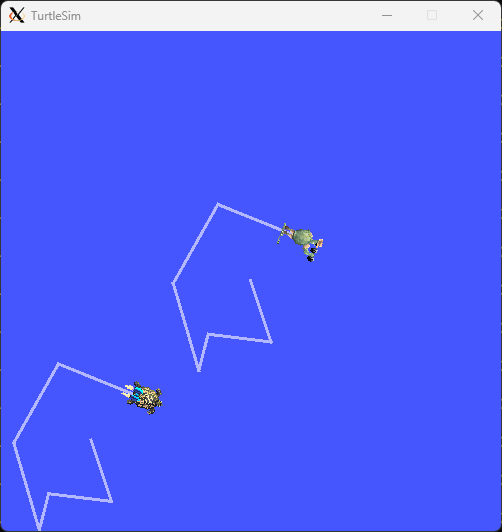
  <figcaption>🚀 My Step 2.8 result — one launch file started <code>turtlesim_node</code> (hosting both turtles) + a <code>mimic</code> node. Driving <code>turtle1</code> with arrow keys made <code>turtle2</code> trace the exact same path via two topic remappings. Zero lines of glue code.</figcaption>
</figure>

Press `Ctrl+C` in each terminal when done.

---

### 🧠 You now know

By the end of Step 2 you should be comfortable with: `ros2 run`, `ros2 node list/info`, `ros2 topic list/info/echo/hz/pub`, `ros2 service list/type/call`, `ros2 param list/get/set/dump/load`, `ros2 bag record/info/play`, `ros2 launch`, and `rqt_graph`. That's the entire daily-driver CLI of a ROS 2 developer.

**Up next:** Step 3 wires this knowledge into your *own* Python package — the `odom_demo` mini-project that's the official Phase 1 deliverable.

---

### 📖 Further reading *(optional reference, not required)*

The walkthrough above covers what you need to move on to the mini-project. If you want deeper background on any specific concept later, these are excellent reference resources — **read them on demand**, don't try to consume them up-front.

| Type | Resource | When to dip in |
|:-:|---|---|
| 📑 | [Official ROS 2 Jazzy tutorials](https://docs.ros.org/en/jazzy/Tutorials.html) | Reference for edge cases and the exact API spec |
| 📘 | *A Concise Introduction to Robot Programming with ROS 2* — Fairchild & Harman | When you want a structured, dev-focused book |
| 🎥 | [Articulated Robotics](https://articulatedrobotics.xyz/) YouTube (Josh Newans) | When you want a visual walkthrough of URDF / Gazebo / Nav2 |
| 🎓 | [The Construct's free ROS 2 Basics](https://www.theconstruct.ai/) | If you want browser-based exercises with no local install |

---

### 🛠️ Step 3 — Write your first ROS 2 package (the mini-project)

<div id="resume-here" class="resume-marker">
  <div class="resume-label"><strong>You are here</strong>Resume from Step 3 — your first ROS 2 package. Tap the floating <em>📍 Resume here</em> button anywhere on the page to jump back.</div>
</div>

> 🎯 **Mini-project deliverable:**A ROS 2 workspace with:
> - A **custom message type** (`VelocityStats.msg`)
> - A **publisher node** emitting fake odometry (`nav_msgs/Odometry`)
> - A **subscriber node** that logs incoming poses and publishes computed velocity stats
> - A **launch file** that starts both with parameters (publish rate, frame id)
>
> By the end you'll have built it with `colcon`, run it under `ros2 launch`, and watched live data flow through `ros2 topic echo`. **This is what 90% of "real" ROS 2 development looks like.**

We'll use two packages so you learn the canonical split most teams use in production:
- `odom_demo_msgs` — a **CMake/ament_cmake** package that defines the custom message (Python packages can't generate IDL code, so msgs live in their own CMake package).
- `odom_demo` — a **Python (ament_python)** package with the publisher + subscriber + launch file.

All commands run inside your existing `~/ros2_ws` from Step 1.

---

**3.1 Open a sourced terminal & verify your workspace**

Open Ubuntu (any new terminal — your `~/.bashrc` from Step 1.6 already sources ROS 2 + the workspace overlay automatically). You don't need to `cd` anywhere — every command in Step 3 uses absolute paths (`~/ros2_ws/src/...`), so you can stay at your home directory the whole time.

Just sanity-check the workspace exists:

```bash
ls ~/ros2_ws/src
```

**Expected:** lists whatever packages you've already created (could be empty if this is a fresh `~/ros2_ws`).

**Why it matters:** every ROS 2 package lives in `<workspace>/src/<pkg_name>/`. `colcon build` (run from the workspace root) scans `src/` recursively and builds whatever it finds. Using absolute paths in the commands below means it doesn't matter where you started — copy-paste each block and it just works.

---

**3.2 Create the custom-message package**

> 🧹 **If you've run Step 3 before** (or the folder exists from a half-finished attempt), `ros2 pkg create` will error with *"package already exists"*. Wipe both packages cleanly first:
> ```bash
> rm -rf ~/ros2_ws/src/odom_demo_msgs ~/ros2_ws/src/odom_demo
> rm -rf ~/ros2_ws/build/odom_demo_msgs ~/ros2_ws/build/odom_demo \
>        ~/ros2_ws/install/odom_demo_msgs ~/ros2_ws/install/odom_demo \
>        ~/ros2_ws/log
> ```
> The first line removes the source folders; the second removes any leftover build artifacts so `colcon build` starts from a clean slate.

```bash
ros2 pkg create --build-type ament_cmake ~/ros2_ws/src/odom_demo_msgs \
  --license Apache-2.0 \
  --dependencies std_msgs builtin_interfaces
```

**Expected:** `ros2` scaffolds `odom_demo_msgs/` with `CMakeLists.txt`, `package.xml`, and empty `include/` + `src/` folders.

> 💡 **Note on the `--license` flag:** without it, you get a harmless warning `Unknown license 'TODO: License declaration'`. `Apache-2.0` is what most ROS 2 packages use — it just sets the `<license>` field in `package.xml` and creates a `LICENSE` file. Pick whatever fits your project (`MIT`, `BSD-3-Clause`, `Apache-2.0`, etc.).

**Why it matters:** `ament_cmake` is required to generate the Python/C++ bindings for custom `.msg`/`.srv`/`.action` files via `rosidl`. The two dependencies are what our message will reference.

Now define the message itself:

```bash
mkdir -p ~/ros2_ws/src/odom_demo_msgs/msg
cat > ~/ros2_ws/src/odom_demo_msgs/msg/VelocityStats.msg << 'EOF'
# Computed velocity statistics from /odom samples
builtin_interfaces/Time stamp
float64 linear_speed       # m/s (magnitude of linear velocity in xy)
float64 angular_speed      # rad/s (absolute yaw rate)
float64 distance_traveled  # cumulative meters since node start
uint32  sample_count       # number of /odom messages seen
EOF
```

**Expected:** no output; file created. `cat` confirms:
```bash
cat ~/ros2_ws/src/odom_demo_msgs/msg/VelocityStats.msg
```

**Why it matters:** message definitions are language-agnostic. Both Python and C++ nodes get auto-generated classes from this one `.msg` file.

Wire the message into the build. Edit `~/ros2_ws/src/odom_demo_msgs/CMakeLists.txt` — find the `find_package(ament_cmake REQUIRED)` line and add **right after it**:

```cmake
find_package(rosidl_default_generators REQUIRED)
find_package(builtin_interfaces REQUIRED)

rosidl_generate_interfaces(${PROJECT_NAME}
  "msg/VelocityStats.msg"
  DEPENDENCIES builtin_interfaces
)

ament_export_dependencies(rosidl_default_runtime)
```

And in `~/ros2_ws/src/odom_demo_msgs/package.xml`, add these inside the `<package>` tag (anywhere among the existing `<depend>` lines):

```xml
<buildtool_depend>rosidl_default_generators</buildtool_depend>
<exec_depend>rosidl_default_runtime</exec_depend>
<member_of_group>rosidl_interface_packages</member_of_group>
```

**Why it matters:** these three additions are the canonical "this package contains messages" declaration. Without them, `colcon build` would create the package but no `VelocityStats` class would be importable.

---

**3.3 Create the Python package**

```bash
ros2 pkg create --build-type ament_python ~/ros2_ws/src/odom_demo \
  --license Apache-2.0 \
  --dependencies rclpy nav_msgs geometry_msgs odom_demo_msgs
```

**Expected:** `odom_demo/` scaffolded with `package.xml`, `setup.py`, `setup.cfg`, `resource/odom_demo`, and an empty `odom_demo/odom_demo/` Python module folder.

**Why it matters:** `ament_python` packages are plain `setup.py` projects — no CMake. The dependencies you pass become `<exec_depend>` entries in `package.xml` so `rosdep` knows what to install.

---

**3.4 Write the publisher node (fake odometry)**

```bash
cat > ~/ros2_ws/src/odom_demo/odom_demo/odom_publisher.py << 'EOF'
import math
import rclpy
from rclpy.node import Node
from nav_msgs.msg import Odometry
from geometry_msgs.msg import Quaternion

class OdomPublisher(Node):
    def __init__(self):
        super().__init__('odom_pub')
        self.declare_parameter('publish_rate_hz', 10.0)
        self.declare_parameter('frame_id', 'odom')
        self.declare_parameter('radius', 2.0)
        self.declare_parameter('angular_speed', 0.5)  # rad/s

        rate = self.get_parameter('publish_rate_hz').value
        self.frame_id = self.get_parameter('frame_id').value
        self.radius = self.get_parameter('radius').value
        self.omega = self.get_parameter('angular_speed').value

        self.pub = self.create_publisher(Odometry, '/odom', 10)
        self.timer = self.create_timer(1.0 / rate, self.tick)
        self.t0 = self.get_clock().now()
        self.get_logger().info(
            f'odom_pub up: rate={rate}Hz frame={self.frame_id} '
            f'radius={self.radius}m omega={self.omega}rad/s'
        )

    def tick(self):
        now = self.get_clock().now()
        t = (now - self.t0).nanoseconds * 1e-9
        theta = self.omega * t

        msg = Odometry()
        msg.header.stamp = now.to_msg()
        msg.header.frame_id = self.frame_id
        msg.child_frame_id = 'base_link'
        msg.pose.pose.position.x = self.radius * math.cos(theta)
        msg.pose.pose.position.y = self.radius * math.sin(theta)
        msg.pose.pose.orientation = Quaternion(
            x=0.0, y=0.0, z=math.sin(theta / 2), w=math.cos(theta / 2)
        )
        msg.twist.twist.linear.x = self.radius * self.omega
        msg.twist.twist.angular.z = self.omega
        self.pub.publish(msg)

def main():
    rclpy.init()
    rclpy.spin(OdomPublisher())
    rclpy.shutdown()

if __name__ == '__main__':
    main()
EOF
```

**Expected:** no output; file created. Sanity-check with `wc -l` — should be ~45 lines.

**Why it matters:** this is the canonical ROS 2 Python node pattern: subclass `Node`, declare parameters, create publishers/timers in `__init__`, do work in callbacks. We're faking a robot driving in a circle so `/odom` has realistic-looking data.

---

**3.5 Write the subscriber node (computes velocity stats)**

```bash
cat > ~/ros2_ws/src/odom_demo/odom_demo/odom_subscriber.py << 'EOF'
import math
import rclpy
from rclpy.node import Node
from nav_msgs.msg import Odometry
from odom_demo_msgs.msg import VelocityStats

class OdomSubscriber(Node):
    def __init__(self):
        super().__init__('odom_sub')
        self.sub = self.create_subscription(Odometry, '/odom', self.on_odom, 10)
        self.pub = self.create_publisher(VelocityStats, '/velocity_stats', 10)
        self.prev = None
        self.distance = 0.0
        self.count = 0
        self.get_logger().info('odom_sub up: listening on /odom, publishing /velocity_stats')

    def on_odom(self, msg: Odometry):
        self.count += 1
        x, y = msg.pose.pose.position.x, msg.pose.pose.position.y
        t = msg.header.stamp.sec + msg.header.stamp.nanosec * 1e-9

        linear_speed = math.hypot(msg.twist.twist.linear.x, msg.twist.twist.linear.y)
        angular_speed = abs(msg.twist.twist.angular.z)

        if self.prev is not None:
            dx, dy = x - self.prev[0], y - self.prev[1]
            self.distance += math.hypot(dx, dy)
        self.prev = (x, y, t)

        out = VelocityStats()
        out.stamp = msg.header.stamp
        out.linear_speed = linear_speed
        out.angular_speed = angular_speed
        out.distance_traveled = self.distance
        out.sample_count = self.count
        self.pub.publish(out)

        if self.count % 10 == 0:
            self.get_logger().info(
                f'#{self.count}: pos=({x:.2f},{y:.2f}) '
                f'v={linear_speed:.2f}m/s w={angular_speed:.2f}rad/s '
                f'dist={self.distance:.2f}m'
            )

def main():
    rclpy.init()
    rclpy.spin(OdomSubscriber())
    rclpy.shutdown()

if __name__ == '__main__':
    main()
EOF
```

**Expected:** file created. The subscriber logs every 10th sample (so once per second at 10 Hz) and republishes computed stats on `/velocity_stats` using your **custom message** — closing the loop on the deliverable.

**Why it matters:** this is the other half of the canonical pattern — a `create_subscription` callback that does work and republishes. Real nodes (Nav2 costmaps, EKF localizers, controllers) follow exactly this shape, just with more math.

---

**3.6 Wire the entry points and write the launch file**

ROS 2 needs to know which Python functions are runnable nodes. Edit `~/ros2_ws/src/odom_demo/setup.py` and find the `entry_points={...}` block. Replace it with:

```python
    entry_points={
        'console_scripts': [
            'odom_publisher = odom_demo.odom_publisher:main',
            'odom_subscriber = odom_demo.odom_subscriber:main',
        ],
    },
```

Also make sure the launch folder gets installed — find the `data_files=[...]` list in `setup.py` and add this entry (keep the existing ones):

```python
        ('share/' + package_name + '/launch', ['launch/demo.launch.py']),
```

You may also need `import os` and `from glob import glob` at the top of `setup.py` if not already present.

Now create the launch file:

```bash
mkdir -p ~/ros2_ws/src/odom_demo/launch
cat > ~/ros2_ws/src/odom_demo/launch/demo.launch.py << 'EOF'
from launch import LaunchDescription
from launch.actions import DeclareLaunchArgument
from launch.substitutions import LaunchConfiguration
from launch_ros.actions import Node

def generate_launch_description():
    rate = LaunchConfiguration('publish_rate_hz')
    radius = LaunchConfiguration('radius')

    return LaunchDescription([
        DeclareLaunchArgument('publish_rate_hz', default_value='10.0'),
        DeclareLaunchArgument('radius', default_value='2.0'),

        Node(
            package='odom_demo',
            executable='odom_publisher',
            name='odom_pub',
            output='screen',
            parameters=[{
                'publish_rate_hz': rate,
                'radius': radius,
                'frame_id': 'odom',
                'angular_speed': 0.5,
            }],
        ),
        Node(
            package='odom_demo',
            executable='odom_subscriber',
            name='odom_sub',
            output='screen',
        ),
    ])
EOF
```

**Expected:** no output; launch file created. It declares two CLI-overridable arguments (`publish_rate_hz`, `radius`) and starts both nodes.

**Why it matters:** launch files are the production deployment unit in ROS 2. `DeclareLaunchArgument` + `LaunchConfiguration` is how you parameterize them so the same launch file works in sim, lab, and field.

---

**3.7 Build & source**

```bash
cd ~/ros2_ws
colcon build --packages-select odom_demo_msgs odom_demo
```

**Expected:** ~10–30 seconds of build output ending with:
```
Summary: 2 packages finished [XXs]
```

**Why it matters:** `--packages-select` builds *only* these two packages (faster than rebuilding everything). `odom_demo_msgs` builds first because `odom_demo` depends on it — colcon figures the order out from `package.xml`.

Now re-source the workspace so the new packages are on the path **in this shell**:

```bash
source install/setup.bash
```

**Expected:** no output. (Future shells get this automatically via the `source ~/ros2_ws/install/setup.bash` line you added to `~/.bashrc` in Step 1.6.)

---

**3.8 Run it & validate**

In **terminal 1** — launch both nodes:

```bash
ros2 launch odom_demo demo.launch.py
```

**Expected:** within a second you should see interleaved logs like:
```
[odom_pub-1] [INFO] odom_pub up: rate=10.0Hz frame=odom radius=2.0m omega=0.5rad/s
[odom_sub-2] [INFO] odom_sub up: listening on /odom, publishing /velocity_stats
[odom_sub-2] [INFO] #10: pos=(1.96,-0.40) v=1.00m/s w=0.50rad/s dist=1.00m
[odom_sub-2] [INFO] #20: pos=(1.84,-0.79) v=1.00m/s w=0.50rad/s dist=2.00m
```

In **terminal 2** — inspect the system live:

```bash
ros2 topic list                          # /odom and /velocity_stats should appear
ros2 topic echo /velocity_stats --once   # one sample of your custom message
ros2 topic hz /odom                      # confirms ~10 Hz
ros2 node info /odom_pub                 # lists publisher with type nav_msgs/msg/Odometry
ros2 param get /odom_pub radius          # → 2.0
```

**Try overriding a parameter at launch time:**

```bash
ros2 launch odom_demo demo.launch.py publish_rate_hz:=50.0 radius:=5.0
```

**Expected:** subscriber log shows `v=2.50m/s` (= radius × omega = 5.0 × 0.5) and `ros2 topic hz /odom` reports ~50 Hz. That confirms launch arguments flow through to ROS parameters correctly.

**Why it matters:** this end-to-end loop — *build → launch → introspect → tweak params → re-launch* — is **the development cycle** you'll use every day. Everything past this point in your robotics career (Nav2 stacks, MoveIt motion plans, custom controllers) is just bigger versions of this same loop.

---

### 🧠 You now know

By the end of Step 3 you can: scaffold ROS 2 packages (both flavors), author a custom message, write publisher and subscriber nodes in Python with parameters, wire them into a launch file with arguments, build with `colcon`, and validate the running system with the Step 2 introspection tools. **That's a working ROS 2 developer's full toolkit.**


### ✅ Validation Checkpoint

In one Ubuntu shell, build and launch:
```bash
cd ~/ros2_ws && colcon build --packages-select odom_demo
source install/setup.bash
ros2 launch odom_demo demo.launch.py
```
In a second shell, inspect the live topic:
```bash
source ~/ros2_ws/install/setup.bash
ros2 topic list           # your topic should appear
ros2 topic echo /odom     # see messages streaming
ros2 topic hz /odom       # confirm publish rate matches your timer
ros2 node info /odom_pub  # see your custom msg type listed
```
If both nodes start cleanly, the topic streams at the expected rate, and the subscriber logs computed velocities → **Phase 1 is done**.

<div class="copilot-note">

### 🤖 How Copilot can boost Phase 1

- 🏗️ **Scaffold packages** — say "create a ROS 2 Python package called `odom_demo` with a publisher and subscriber" and I'll generate `setup.py`, `package.xml`, the node files, and an `ament` launch file.
- 📖 **Translate concepts on demand** — explain the difference between topics/services/actions, pub-sub QoS profiles, or how `tf2` time travel works, in the context of your 25-year-dev background.
- 🧩 **Write launch files** in Python — composable, with arguments, conditions, and grouping.
- 🐞 **Decode cryptic ROS errors** — `lookup would require extrapolation into the past`, `failed to load controller`, missing transforms… I'll explain the root cause.
- 📝 **Code review** your first nodes — I'll flag missing QoS, blocking calls in callbacks, unmanaged thread issues.

</div>

---

## 🌍 Phase 2 — Simulation Deep Dive


> ⏰ **3–4 weeks** &nbsp;·&nbsp; 🎯 **Goal:** Spawn a robot in Gazebo, drive it, read its sensors, visualize in RViz2.

🤖 **Pick a simulated robot to learn on:**

- ⭐ **TurtleBot 4** (preferred — has excellent Gazebo model, mirrors a real robot you can buy later)
- 🔧 Alternative: build your own URDF from scratch (Articulated Robotics has a great series on this)

🧩 **Topics to cover:**

- 📐 **URDF / Xacro** — describing the robot's geometry, joints, inertia
- 🔌 **Gazebo plugins** for differential drive, lidar, camera, IMU
- 👁️ **RViz2** — visualizing tf trees, point clouds, costmaps
- 🎛️ **`ros2_control`** — the standard hardware abstraction layer (do this now so swapping to real hardware later is trivial)

> 🎯 **Mini-project deliverable:** Teleop a simulated TurtleBot around a Gazebo world; visualize its lidar scan in RViz2.

### ✅ Validation Checkpoint

Launch the simulator, teleop, and RViz2 (three shells):
```bash
# Shell 1 — simulator
ros2 launch turtlebot4_ignition_bringup turtlebot4_ignition.launch.py rviz:=true

# Shell 2 — teleop
ros2 run teleop_twist_keyboard teleop_twist_keyboard \
  --ros-args -r cmd_vel:=/cmd_vel

# Shell 3 — sanity checks
ros2 topic hz /scan            # lidar should publish at ~5–10 Hz
ros2 topic echo /odom --once   # odometry has a real pose
ros2 run tf2_tools view_frames # generate a tf tree PDF
```
✅ You should see: TurtleBot moving in Gazebo when you press WASD, a live red laser ring around it in RViz2, and a TF tree with `odom → base_link → laser_frame`.

<figure class="screenshot">
  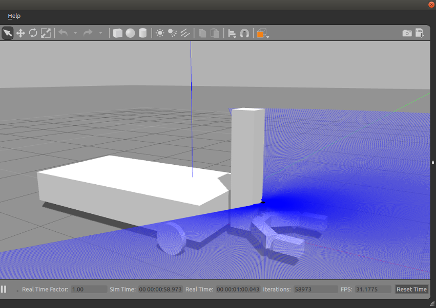
  <figcaption>🌍 Success looks like this — your simulated robot lives in a 3D world and its sensors (here, a blue projection from a depth/lidar sensor) react to obstacles in real time. From here it's all software, all the way down.</figcaption>
</figure>

<div class="copilot-note">

### 🤖 How Copilot can boost Phase 2

- 🦴 **Generate URDF/Xacro** — describe your robot in plain English ("differential-drive base 30 cm wide, 8 cm wheels, a Hokuyo lidar on top") and I'll produce the full Xacro with inertia, collision, visual, transmissions.
- ⚙️ **Write `ros2_control` config** — controller manager YAML, `diff_drive_controller`, `joint_state_broadcaster`, plus the Gazebo system plugin.
- 🌍 **Build Gazebo worlds** — generate `.sdf` worlds with walls, doors, lighting, or import a 3D model.
- 🪲 **Debug Gazebo crashes** — paste the stderr; I'll point to plugin mismatches, missing meshes, or TF cycles.
- 🎛️ **Tune simulation params** — physics step size, max contacts, real-time factor.
- 👁️ **Author RViz configs** (`.rviz` files) for your robot.

</div>

---

## 🧭 Phase 3 — Navigation & Perception


> ⏰ **4–6 weeks** &nbsp;·&nbsp; 🎯 **Goal:** Take a simulated robot from "no idea where it is" to **autonomously navigating a map it built itself**, using the production-grade ROS 2 navigation stack.

**Two pillars you'll learn:**

1. **SLAM** — *Simultaneous Localization And Mapping*. Drive around manually while the robot builds a 2D occupancy grid from its lidar scans.
2. **Nav2** — the ROS 2 navigation stack. Given a saved map + a goal pose, it plans a global path, follows it with a local controller, avoids dynamic obstacles, and recovers when stuck.

We'll use **TurtleBot 3** in Gazebo as the simulated robot — it ships with `nav2_bringup` and works out of the box on Jazzy. Everything you learn transfers directly to TurtleBot 4, custom robots, or your own hardware in Phase 5.

> 🎯 **Phase 3 deliverable:** drive the robot to map an environment, save the map, restart with localization, send a goal in RViz2, and watch it autonomously plan + drive + avoid obstacles + announce "Goal succeeded".

---

### 🛠️ Step 1 — Install Nav2 + the simulated robot

Open a new Ubuntu terminal (your `~/.bashrc` from Phase 1 sources ROS 2 + your workspace overlay automatically).

```bash
sudo apt update
sudo apt install -y \
  ros-jazzy-navigation2 \
  ros-jazzy-nav2-bringup \
  ros-jazzy-turtlebot3* \
  ros-jazzy-slam-toolbox
```

**Expected:** apt pulls in a few hundred MB (Nav2 is a big stack — costmap layers, planners, controllers, behavior trees, the lifecycle manager, etc.). Ends with `0 upgraded, NN newly installed`. Takes 1–5 min depending on bandwidth.

**Why it matters:** these four meta-packages give you everything: `navigation2` is the runtime, `nav2_bringup` has ready-to-run launch files + a sample world, `turtlebot3_*` is the simulated robot model + Gazebo plugins, `slam_toolbox` is the SLAM library that builds maps from lidar.

Add two persistent environment variables (TurtleBot 3 needs these — pick `waffle` since it has a 360° lidar):

```bash
echo 'export TURTLEBOT3_MODEL=waffle' >> ~/.bashrc
echo 'export GAZEBO_MODEL_PATH=$GAZEBO_MODEL_PATH:/opt/ros/jazzy/share/turtlebot3_gazebo/models' >> ~/.bashrc
source ~/.bashrc
```

**Expected:** no output. Verify with `echo $TURTLEBOT3_MODEL` → `waffle`.

**Why it matters:** TurtleBot 3 ships in three flavors (burger, waffle, waffle_pi). Without `TURTLEBOT3_MODEL` set, the launch files will fail with "model not specified". The `GAZEBO_MODEL_PATH` lets Gazebo find the mesh files.

---

### 🚀 Step 2 — Launch the simulated world & meet the robot

In **Terminal A**:

```bash
ros2 launch nav2_bringup tb3_simulation_launch.py headless:=False
```

**Expected:** after ~20–40 seconds (Gazebo cold start), three windows open:
1. **Gazebo** — a small apartment-like world with the TurtleBot 3 sitting near the origin.
2. **RViz2** — the visualization tool showing the robot's coordinate frames, sensor data, and (soon) the costmaps.
3. A flurry of terminal logs ending with `Creating bond timer` from `bt_navigator` and `behavior_server` — that's Nav2 reporting it's healthy.

**What just started, conceptually:** *one* launch file brought up ~15 nodes: the Gazebo sim, the TurtleBot 3 robot description, all the Nav2 servers (planner, controller, behavior server, BT navigator, lifecycle manager, AMCL, map server, costmap layers), and RViz2 pre-configured with the right displays. **This is why launch files matter** — Phase 1's mimic demo was the same pattern, just 2 nodes instead of 15.

In **Terminal B**, peek at what's running:

```bash
ros2 node list | wc -l
ros2 topic list | grep -E '^/(scan|odom|cmd_vel|tf|map)$'
```

**Expected:** ~15+ nodes; the four canonical robot topics all present (`/scan` = lidar, `/odom` = odometry, `/cmd_vel` = command velocity, `/tf` = frame transforms, `/map` = the map once SLAM/AMCL is up).

**Why it matters:** every ROS 2 mobile robot — sim or real — exposes this same set of topics. Once you can navigate this one, you can debug any of them.

---

### 🗺️ Step 3 — Build a map with SLAM

The launch you started in Step 2 uses a *pre-existing* map. To build your own, stop it (`Ctrl+C` in Terminal A) and restart with SLAM enabled:

```bash
ros2 launch nav2_bringup tb3_simulation_launch.py headless:=False slam:=True
```

**Expected:** same windows, but now `slam_toolbox` is running and RViz2 shows an empty grey grid — that's the map being built live. The robot's lidar (red dots / arc) is visible.

In **Terminal B**, start teleop so you can drive:

```bash
ros2 run turtlebot3_teleop teleop_keyboard
```

**Expected:** instructions printed (`w`/`x` = forward/back, `a`/`d` = turn, `s` = stop). Each keypress nudges the robot.

**Drive slowly** around the apartment — go down hallways, into rooms, around obstacles. Watch the RViz2 map fill in: black = walls (lidar hits), grey = unknown, white = free space. **The robot needs to physically "see" every wall with its lidar to map it.** Loops are good — closing a loop tells SLAM to refine the whole map.

**Verify the map is being built:**

```bash
ros2 topic hz /map           # should publish at ~1–2 Hz
ros2 topic echo /map --once  # huge dump — but width/height grow as you explore
```

**Why it matters:** SLAM is doing two jobs at once — figuring out where the robot *is* (localization) using lidar + odometry, and recording what it *sees* (mapping). The "simultaneous" part is the hard one: you need to know where you are to draw the map, but you need the map to know where you are. `slam_toolbox` solves it with iterative scan matching + pose graph optimization.

---

### 💾 Step 4 — Save the map

Once the map looks complete (most walls drawn, white free-space everywhere you've driven), save it from **Terminal B** (kill teleop first with `Ctrl+C`):

```bash
mkdir -p ~/maps
ros2 run nav2_map_server map_saver_cli -f ~/maps/apartment
```

**Expected:**
```
[INFO] Map saved successfully
```
And two new files in `~/maps/`:

```bash
ls ~/maps/
# apartment.pgm  apartment.yaml
```

- `apartment.pgm` — the actual occupancy grid as a greyscale image (open it with any image viewer to verify).
- `apartment.yaml` — metadata: resolution (m/pixel), origin (world coordinates of the bottom-left corner), thresholds for free/occupied.

**Why it matters:** a saved map is just a PGM + YAML. You can hand-edit the PGM in GIMP to remove transient obstacles (a chair that was there during mapping but isn't permanent), check it into git, or load it on a totally different robot. This portability is one of ROS 2's quietly powerful features.

Now stop the SLAM launch (`Ctrl+C` in Terminal A).

---

### 📍 Step 5 — Relaunch in localization mode (AMCL)

```bash
ros2 launch nav2_bringup tb3_simulation_launch.py headless:=False \
  map:=$HOME/maps/apartment.yaml
```

**Expected:** Gazebo + RViz2 come back up. RViz2 shows your saved map *and* a **green cloud of arrows** scattered around the robot — that's the **AMCL particle filter**: each arrow is a hypothesis about where the robot might be. Spread = uncertainty.

**Give the robot its initial pose** so AMCL converges:
1. In RViz2, click the **`2D Pose Estimate`** button in the top toolbar.
2. Click on the map where the robot actually is (you can see its true position in Gazebo).
3. Drag in the direction it's facing.
4. Release.

**Expected:** the green particle cloud collapses to a tight clump around the robot. That's AMCL saying "ok, I know where I am now."

**Why it matters:** the difference between SLAM and AMCL is what they assume. SLAM assumes nothing — "I don't know where I am and I don't have a map, figure both out." AMCL assumes you have a map and just need to figure out your pose within it. On a real robot you'd map once (Step 3–4), then use AMCL forever after.

---

### 🎯 Step 6 — Send a navigation goal from RViz2

This is the payoff:

1. In RViz2, click the **`Nav2 Goal`** button in the top toolbar.
2. Click somewhere on the map you want the robot to go.
3. Drag to set its final orientation.
4. Release.

**Expected:** within ~1 second you should see:
- A **coloured path line** appear from the robot to the goal (the global plan).
- Tinted overlays on the map (cyan/pink/purple) — that's the **costmap inflation layer** marking the "do not drive here" zones around obstacles.
- The robot starts physically driving in Gazebo, following the path.
- When it arrives, the BT navigator logs `Goal succeeded` in Terminal A.

**Verify the planning chain in Terminal B:**

```bash
ros2 topic echo /plan --once | head -20            # the global plan poses
ros2 topic hz /local_costmap/costmap               # local costmap updates ~5 Hz
ros2 topic echo /behavior_tree_log --once | head   # see which BT nodes fired
```

**Why it matters:** that single click triggered the whole Nav2 stack — global planner (`NavfnPlanner` by default, computes the path), local controller (`DWB`, follows it while avoiding moving obstacles), recovery behaviors (spin, back up, clear costmap), behavior tree orchestrator. Every commercial autonomous robot you've seen (warehouse AMRs, restaurant delivery bots) runs this exact stack or a fork of it.

---

### 🤖 Step 7 — Send a goal from the CLI (no RViz needed)

RViz is great for humans but in production goals come from code. Nav2 exposes a ROS 2 **action**: `/navigate_to_pose`.

```bash
ros2 action send_goal /navigate_to_pose nav2_msgs/action/NavigateToPose \
  "{pose: {header: {frame_id: 'map'}, pose: {position: {x: 1.5, y: 0.5, z: 0.0}, orientation: {w: 1.0}}}}" \
  --feedback
```

**Expected:** the robot starts driving toward (x=1.5, y=0.5). The terminal streams live `feedback:` blocks showing `distance_remaining`, `current_pose`, `navigation_time` until it ends with `result: {result: SUCCEEDED}`.

**Why it matters:** **this is how you write autonomous behavior.** Replace that one-shot CLI call with a Python node that picks goals from a queue (a delivery list, a patrol route, an exploration policy), and you have a real autonomous robot. The whole Nav2 stack is just "give me a goal, I'll get you there."

---

### 🛠️ Step 8 — Inspect & tune

While Nav2 is running, change parameters live without restarting (the lesson from Phase 1 Step 2.6, scaled up):

```bash
# What controllers/planners are loaded?
ros2 param get /controller_server FollowPath.plugin
ros2 param get /planner_server GridBased.plugin

# Slow the robot down by 50% — try a goal again, it'll feel sluggish
ros2 param set /controller_server FollowPath.max_vel_x 0.13

# Watch the costmap inflation radius live (try 0.3, then 1.0 — bigger = more cautious)
ros2 param set /global_costmap/global_costmap inflation_layer.inflation_radius 1.0

# What's the BT navigator actually doing?
ros2 topic echo /behavior_tree_log
```

**Expected:** each `param set` returns `successful: true` and the next navigation goal reflects the change. The behavior tree log shows nodes like `RateController`, `ComputePathToPose`, `FollowPath`, `RecoveryNode` flipping between `IDLE` / `RUNNING` / `SUCCESS` in real time.

**Why it matters:** real-world Nav2 tuning is 80% of deployment work. Wrong inflation → robot scrapes walls or refuses to enter doorways. Wrong `max_vel_x` → either crawls or crashes. Now you know how to twiddle them without recompiling anything.

---

### 🧠 You now know

By the end of Phase 3 you can: install + launch the full Nav2 stack, build a map with SLAM, save and reload it, localize with AMCL, send goals from both RViz and the CLI/code, inspect the behavior tree, and live-tune costmap + controller parameters. **That's the navigation skillset of a hire-able ROS 2 robotics engineer.**

### ✅ Validation Checkpoint

Reproduce this end-to-end sequence three times in a row, with no errors:

```bash
# 1) Map with SLAM (drive around in Gazebo with teleop until map looks complete)
ros2 launch nav2_bringup tb3_simulation_launch.py headless:=False slam:=True
# in another terminal:
ros2 run turtlebot3_teleop teleop_keyboard
ros2 run nav2_map_server map_saver_cli -f ~/maps/apartment

# 2) Restart in localization + Nav2 mode, set initial pose in RViz2
ros2 launch nav2_bringup tb3_simulation_launch.py headless:=False \
  map:=$HOME/maps/apartment.yaml

# 3) Send three different goals from RViz2 (click "Nav2 Goal")
ros2 topic echo /behavior_tree_log --once   # confirm BT fired
```

✅ Robot autonomously plans + drives + avoids obstacles + announces "Goal succeeded" at the target. Reproducible three times in a row = **Phase 3 done**.

<figure class="screenshot">
  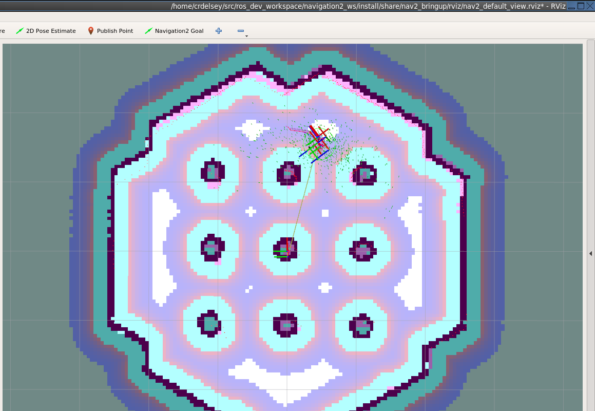
  <figcaption>🧭 Success looks like this — RViz2 showing your map (occupancy grid), the costmap inflation layers (cyan → pink → purple), the AMCL particle swarm (green dots) localizing your robot, and a planned path. Click <em>Navigation2 Goal</em>, click a point, watch it drive.</figcaption>
</figure>

<div class="copilot-note">

### 🤖 How Copilot can boost Phase 3

- 🗺️ **Generate Nav2 config** — full `nav2_params.yaml` tuned for your robot footprint, lidar range, max velocity. I'll explain every parameter so you actually understand it.
- 🌳 **Write/modify behavior trees** — XML BTs for recovery behaviors, custom action/condition nodes in Python or C++.
- 🧠 **Tune SLAM** — `slam_toolbox` configs for online async vs lifelong mapping, loop-closure thresholds, scan match resolution.
- 🛰️ **Debug localization failures** — diagnose AMCL particle clouds, jumpy TFs, costmap inflation issues from your screenshots.
- 📊 **Build evaluation scripts** — automated nav success-rate testing across many start/goal pairs.
- 🎨 **Visualize costmaps** — explain the layer stack, write custom costmap plugins.

</div>

---

## 🦾 Phase 4 — Specialize in Manipulation


> ⏰ **6–10 weeks** &nbsp;·&nbsp; 🎯 **Goal:** Plan and execute collision-free arm motions, then build a full pick-and-place pipeline in simulation.

> ✅ **Why manipulation for you:** highest density of industrial/commercial jobs, deepest math (kinematics, dynamics, optimization, contact), and the gap between hobby and pro is real — so 25 years of engineering experience pays off fast.

> 💡 Other valid tracks if your interest pulls elsewhere: 🚗 mobile (continue Phase 3), 🚁 drones (PX4 + ROS 2), 🧠 RL (NVIDIA Isaac Lab), 👁️ vision (YOLO + RGB-D). Same plan structure applies — swap MoveIt for the equivalent stack.

### 📚 The 4 things to actually learn

| # | Topic | Why it matters | Where to start |
|:-:|---|---|---|
| 1 | **🧮 Kinematics & dynamics** | The language of arms — FK, IK, Jacobians, singularities | [Modern Robotics (Lynch & Park)](https://hades.mech.northwestern.edu/index.php/Modern_Robotics) — free book + Coursera |
| 2 | **🦿 MoveIt 2** | The de-facto ROS 2 motion-planning framework | [MoveIt 2 tutorials](https://moveit.picknik.ai/main/index.html) |
| 3 | **🤏 Grasping & MTC** | Going from "move to pose" to "grab that object" | [MoveIt Task Constructor](https://github.com/moveit/moveit_task_constructor) |
| 4 | **👁️ Perception → pose** | Closing the loop: RGB-D → object → grasp pose | [Open3D](https://www.open3d.org/) + [GPD](https://github.com/atenpas/gpd) |

### 🤖 Pick your simulated arm

| Tier | Arm | Why | Real-world cost |
|:-:|---|---|---|
| 🥇 | **Franka Emika Panda** (FR3) | The default MoveIt demo robot — every tutorial uses it. Best ecosystem. | ~$15K (free in sim) |
| 🥈 | **Universal Robots UR5e / UR10e** | What you'll meet in industry. `ur_robot_driver` is rock solid. | ~$35K (free in sim) |
| 🥉 | **WidowX 250 S** | Affordable real arm if you want to buy one later (Phase 5) | ~$2.4K (buyable) |

> 💡 **Start with Panda in sim** — every tutorial works out of the box. Switch to UR later for industry skills, or WidowX if you plan to buy real hardware.

### 🗓️ Suggested 8-week roadmap

**Weeks 1–2 · Foundations**
- 🧠 Modern Robotics ch. 3–6: rigid-body motions, FK, velocity kinematics, IK
- 📦 Install MoveIt 2 + Panda demo: `ros2 launch moveit2_tutorials demo.launch.py`
- 🎮 In RViz, drag the end-effector, hit **Plan & Execute**, watch IK solve

**Weeks 3–4 · MoveIt programmatic API**
- 🐍 `moveit_py` (Python) — joint-space goals, pose goals, Cartesian paths
- 🚧 Add collision objects (the green box in the screenshot below)
- 📐 Constrained planning: orientation locked (e.g., keep a glass upright)

**Weeks 5–6 · Pick-and-place with MTC**
- 🧱 MoveIt Task Constructor stages: approach → pre-grasp → close gripper → lift → place
- 🦾 Spawn Panda + gripper + table + 3 cubes in Gazebo
- 🎯 Pick each cube, stack them. 10/10 successful runs = ✅ done

**Weeks 7–8 · Vision-driven grasping**
- 🎥 Add an RGB-D camera (sim) — `/depth/points` PointCloud2
- 🔍 Segment table + objects (Open3D plane fit + Euclidean clustering)
- ✋ Generate grasp poses (GPD or hand-crafted top-down grasps)
- 🤝 Feed pose → MTC → execute. Now your robot picks up things it has never seen before.

### 🛠️ Tools you'll live in

- 🦿 **MoveIt 2** — planning, IK, collision checking, trajectory execution
- 🌍 **Gazebo (Harmonic)** — physics sim
- 🎛️ **`ros2_control`** — joint-trajectory controllers, gripper command interfaces
- 🐍 **`moveit_py`** — Python bindings for fast prototyping
- 📊 **RViz2 MotionPlanning plugin** — your debugger
- 🧪 **MoveIt Task Constructor (MTC)** — composable manipulation pipelines

> 🎯 **Mini-project deliverable:** Vision-driven pick-and-place — Panda picks an unknown object from clutter on a table using only an RGB-D camera + MTC, and places it in a target zone.

### ✅ Validation Checkpoint

Run the demo, then add complexity step by step:
```bash
# 1) Baseline — Panda demo + MotionPlanning panel in RViz
ros2 launch moveit2_tutorials demo.launch.py

# 2) Programmatic motion (your code)
ros2 run my_panda_pkg pose_goal_demo.py

# 3) Pick & place pipeline (MTC)
ros2 launch my_panda_pkg pick_place.launch.py
ros2 topic echo /execute_task_solution/_action/status --once

# 4) Vision-driven (final boss)
ros2 launch my_panda_pkg vision_pick.launch.py
```
✅ Achieved when: vision pipeline runs end-to-end, Panda picks a never-before-seen object from clutter, places it in the target zone — **10/10 successful runs** = Phase 4 done.

<figure class="screenshot">
  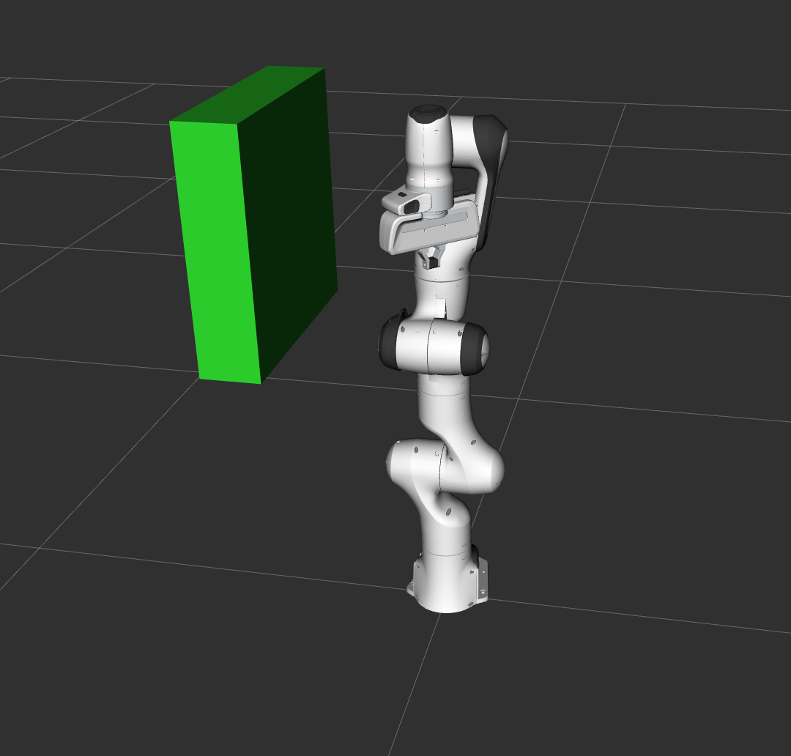
  <figcaption>🦾 Success looks like this — your Panda arm in RViz2 with a collision object in the scene. Once you can drag the end-effector, hit <em>Plan &amp; Execute</em>, and watch MoveIt route around obstacles, you've crossed into manipulation.</figcaption>
</figure>

<div class="copilot-note">

### 🤖 How Copilot can boost Phase 4 (manipulation)

- 🦿 **Generate full MoveIt config packages** — SRDF, controllers, kinematics solver choice (KDL / TracIK / pick_ik), planning pipelines (OMPL / Pilz / STOMP). Faster than the setup_assistant GUI and gives you something to read.
- 🧮 **Derive & code IK/FK by hand** — when you want to actually understand what MoveIt does under the hood. I'll walk you through the Modern Robotics math line by line.
- 🤏 **Write MoveIt Task Constructor pipelines** — full pick-and-place stage trees in C++ or Python, with grasp generation and approach/retreat planning.
- 🎥 **Wire up perception → grasping** — `pcl_ros` / Open3D pipelines: point cloud → segment → cluster → fit primitives → emit grasp `PoseStamped`.
- 🪲 **Debug planning failures** — paste the OMPL log or `move_group` errors; I'll diagnose collision matrix issues, IK timeouts, joint-limit violations, octomap inflation.
- 🧪 **Author headless test scenarios** — `pytest` + `launch_testing` to run "spawn cubes, attempt pick, assert success" in CI.
- 📚 **Curate a week-by-week study plan** — Modern Robotics chapter pairings with hands-on MoveIt exercises so theory and code reinforce each other.

</div>

---
## 🛒 Phase 5 — Buy Hardware


> ⏰ **After ~3 months of sim work**

**🎯 Selection criteria — in order:**

1. ✅ Has an *officially supported* ROS 2 driver
2. 🌟 Active community / recent commits
3. 📦 Replacement parts available in Israel or shippable
4. 💰 Within your budget for a *learning* robot — don't buy your dream machine first

### 🤖 Recommended first physical robots (by track)

#### 🚗 Mobile ground robot

| Tier | Robot | Price | Notes |
|:-:|---|---|---|
| 🥇 | **TurtleBot 4 Lite** | ~$1,300 | Official ROS 2 reference platform, matches what you simulated. Best beginner choice. |
| 💰 | **LeoRover** / **Husarion ROSbot 2R** | $2K+ | Slightly more capable, outdoor-ish |
| 🛠️ | **DIY:** Raspberry Pi 5 + RPLidar A1 + chassis | ~$300 | Much more learning per shekel, but expect frustration |

#### 🦾 Arm

| Tier | Robot | Price | Notes |
|:-:|---|---|---|
| 🥇 | **WidowX 250 S** (Trossen Robotics) | ~$2,400 | Well-supported in ROS 2/MoveIt |
| 💰 | **SO-100 / SO-ARM100** by Hugging Face LeRobot | ~$120 (parts) | 3D-printed, bleeding edge but cheap and phenomenal learning project |
| 🏭 | **uFactory xArm Lite 6** | ~$5K | Industrial-flavor, real-world relevant |

#### 🚁 Drone

- **Holybro X500 V2 + Pixhawk 6C** — standard PX4 + ROS 2 dev kit

### 🇮🇱 Israel-specific shipping notes

- 📦 Most US/EU robotics vendors ship to Israel but watch for VAT (17%) + customs above ~$75 USD declared value
- 🏪 **Local options:** RobotShop ships to IL; some Aliexpress sellers stock chassis/motors with reasonable delivery
- 🖨️ For 3D-printed builds (SO-ARM100), local makerspaces (XLN in Tel Aviv, Hackerspace TLV) have printers
- ⚠️ Lidar units and lithium batteries occasionally get held in customs — declare honestly

<div class="copilot-note">

### 🤖 How Copilot can boost Phase 5

- 🛒 **Compare options** — paste 2–3 robot spec sheets; I'll build a side-by-side decision matrix weighted to your goals.
- 📜 **Translate manufacturer docs** — Chinese/Japanese supplier datasheets → English summary with electrical/protocol gotchas.
- 🇮🇱 **Israel-specific guidance** — estimate landed cost (USD + VAT + customs), suggest customs broker phrasing for lithium batteries / lidar declarations.
- 🔧 **DIY build plans** — pick parts list with Aliexpress/RobotShop links, generate CAD or scrappy plywood chassis sketches, BOM with shipping ETA.
- 🧾 **Generate purchase justification** if you're expensing — written for an enterprise procurement audience.

</div>

---

## 🔗 Phase 6 — Sim-to-Real Bridge


> ⏰ **2–4 weeks after hardware arrives**

**🚧 Expected pain points and how to handle them:**

- 📡 **Calibration:** real sensors are noisy; tune your filters with real data
- 🎛️ **`ros2_control` hardware interface:** if you used it in sim, swapping is mostly config
- ⏱️ **Timing/latency:** the real world is not deterministic. Use RT_PREEMPT kernel if needed
- 🔋 **Power management:** batteries die at the worst times. Add voltage monitoring early

> 🏁 **Validation milestone:** reproduce your Phase 3 autonomous-navigation milestone on the real robot in your apartment.

<div class="copilot-note">

### 🤖 How Copilot can boost Phase 6

- 🔄 **Sim-to-real config diff** — point me at your sim launch + your hardware driver; I'll generate the unified `ros2_control` config that swaps cleanly.
- 📡 **Sensor calibration scripts** — IMU bias estimation, camera intrinsics (`camera_calibration`), lidar-to-base extrinsics, time-sync between sensors.
- 🐛 **Debug from logs** — paste `ros2 bag` snippets or controller_manager errors; I'll find the bad TF, the dropped message, the off-by-one timer.
- ⚡ **Real-time tuning** — explain RT_PREEMPT vs Xenomai, write `chrt`/cgroup setup, pinpoint priority inversions.
- 🔋 **Power & safety** — generate a battery monitoring node, e-stop wiring/code, watchdog timers on critical loops.
- 📈 **Performance profiling** — convert ROS 2 traces to flame graphs, identify slow callbacks.

</div>

---

## 🎓 Ongoing Learning & Community

### 📖 Books

- 📕 *[Modern Robotics](http://hades.mech.northwestern.edu/index.php/Modern_Robotics)* by Kevin Lynch (free book + Coursera) — the canonical theory text
- 📗 *Probabilistic Robotics* by Thrun et al. — for when you want to *understand* SLAM, not just run it

### 🌐 Communities

- 💬 [ROS Discourse](https://discourse.ros.org/) — official forum, very active
- 🤖 [r/ROS](https://www.reddit.com/r/ROS/), [r/robotics](https://www.reddit.com/r/robotics/) on Reddit
- 🇮🇱 **Israeli community:** IROB (Israel Robotics Association), Technion & TAU robotics labs occasionally host open talks, ROS Israel meetup group (irregular but real)

### 🎓 Free advanced courses

- 🏛️ [MIT 6.4210 (Robotic Manipulation)](https://manipulation.csail.mit.edu/) by Russ Tedrake — uses Drake instead of ROS, but the lectures are world-class

---

## 📅 Suggested Weekly Cadence

| When | What | Duration |
|---|---|:-:|
| 📆 **Weekdays** | Reading/tutorials | 30–60 min |
| 🗓️ **Weekends** | Focused build/debug session, mini-project for that phase | 3–4 hours |

> ⏱️ **At this pace:** Phase 0–3 done in ~3 months, hardware ordered, by month 5–6 you have a working autonomous robot in your home.

---

## ✅ Quick-Start Checklist (do this week)

- [ ] 🐧 Install Ubuntu 24.04 (dual-boot) or set up WSL2
- [ ] 📦 Install ROS 2 Jazzy + Gazebo Harmonic
- [ ] 🐢 Run the turtlesim hello-world
- [ ] 📺 Subscribe to [Articulated Robotics](https://articulatedrobotics.xyz/) on YouTube
- [ ] 🔖 Bookmark https://docs.ros.org/en/jazzy/ and https://navigation.ros.org/
- [ ] 🎯 Decide your Phase 4 specialization tentatively (you can change later)

